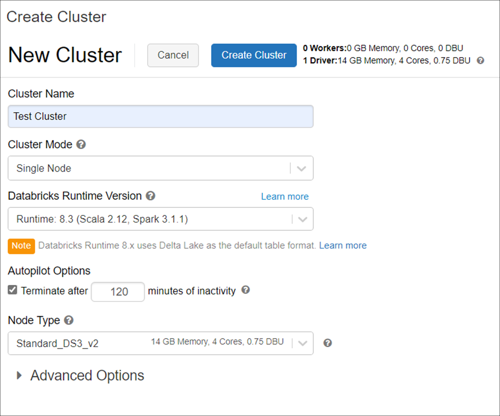
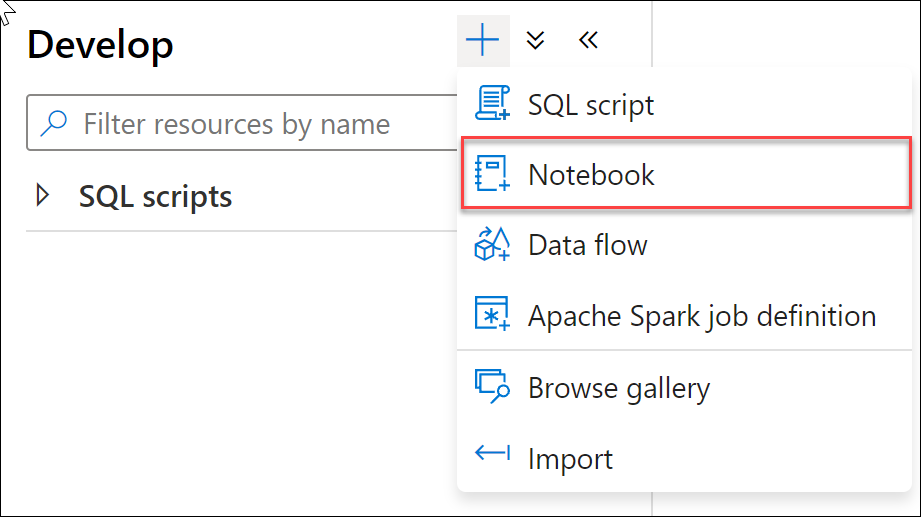

---
lab:
    title: 'Explore compute and storage options for data engineering workloads'
    module: 'Module 1'
---

# Lab 1 - Explore compute and storage options for data engineering workloads

This lab teaches ways to structure the data lake, and to optimize the files for exploration, streaming, and batch workloads. You will learn how to organize the data lake into levels of data refinement as they transform files through batch and stream processing. Then you will learn how to create indexes on their datasets, such as CSV, JSON, and Parquet files, and use them for potential query and workload acceleration.

After completing this lab, you will be able to:

- Combine streaming and batch processing with a single pipeline
- Organize the data lake into levels of file transformation
- Index data lake storage for query and workload acceleration

## Lab setup and pre-requisites

Before starting this lab, ensure you have successfully completed the setup steps to create your lab environment.

## Exercise 1 - Delta Lake architecture

In this exercise, you will use an Azure Databricks workspace and perform Structured Streaming with batch jobs by using Delta Lake. You need to complete the exercise within a Databricks Notebook. To begin, you need to have access to an Azure Databricks workspace.

### Task 1: Create an Azure Databricks cluster

1. Sign into the Azure portal at `https://portal.azure.com`, and navigate to the **data-engineering-synapse-*xxxxxxx*** resource group created by the setup script for this course. Then select the Azure Databricks Service workspace.

    

2. Select **Launch Workspace** to open your Databricks workspace in a new tab.

    

3. In the left-hand menu of your Databricks workspace, select **Compute**.
4. Select **+Create Cluster** to add a new cluster.

    

5. Enter a name for your cluster, such as `Test Cluster`.
6. Select a **Single Node** cluster mode.
7. Select the **Databricks RuntimeVersion**. We recommend the latest runtime and **Scala 2.12**.
8. Set the **Terminate after** timeout to 30 minutes and select the default node type.
9. Select **Create Cluster**.
10. Wait for the cluster to start. Please note you will have to wait 5 - 7 minutes for the cluster to start up before moving onto the next task.

### Task 2: Clone the Databricks archive

1. In the Azure Databricks Workspace, in the left pane, select **Workspace** > **Users**, and select your username (the entry with the house icon).
1. In the pane that appears, select the arrow next to your name, and select **Import**.

    

1. In the **Import Notebooks** dialog box, select the URL and paste in the following URL:

    ```
    https://github.com/MicrosoftLearning/DP-203-Data-Engineer/raw/master/Allfiles/microsoft-learning-paths-databricks-notebooks/data-engineering/DBC/11-Delta-Lake-Architecture.dbc
    ```

1. Select **Import**.
1. Select the **11-Delta-Lake-Architecture** folder that appears.

### Task 3: Run code in the *1-Delta-Architecture* notebook

1. Open the **1-Delta-Architecture** notebook.
1. Attach your cluster to the notebook before following the instructions and running the cells it contains. To run a code cell, select the cell you want to run and then use the **&#x23f5;** button at its top right to run it.

    Within the notebook, you will explore combining streaming and batch processing with a single pipeline.

## Important: Shut down your cluster

1. After you've finished exploring the Azure Databricks notebook; in your Azure Databricks workspace, the left pane, select **Compute** and select your cluster. Then select **Terminate** to stop the cluster.

### Task 2: Execute PowerShell script

1. In the hosted VM environment provided for this course, open Powershell in administrator mode, and execute the following to set the execution policy to Unrestricted so you can run the local PowerShell script file:

    ```
    Set-ExecutionPolicy Unrestricted
    ```

    > **Note**: If you receive a prompt that you are installing the module from an untrusted repository, select **Yes to All** to proceed with the setup.

2. Change directories to the root of this repo within your local file system.

    ```
    cd C:\dp-203\data-engineering-ilt-deployment\Allfiles\00\artifacts\environment-setup\automation\
    ```

3. Enter the following command to run a PowerShell script that creates objects in the SQL pool:

    ```
    .\dp-203-setup-Part02.ps1
    ```

4. When the script is completed run the following command in the PowerShell window:
   
   ```
   exit
   ```

    **NOTE**: This script should run in roughly 10-15 minutes and loads data into Synapse.
>
> If it seems as though the script hangs while creating linked services for the SQLPool01 dedicated SQL pool (there are 3), press **Enter**. This tends to refresh the PowerShell script and allows it to continue to the end.
>
> ### Potential errors that you can ignore
>
> You may encounter a few errors and warnings during the script execution. The errors below can safely be ignored:
>
> 1. The following error may occur when creating SQL users and adding role assignments in the dedicated SQL pool, and can safely be ignored:
>
>       *Principal 'xxx@xxx.com' could not be created. Only connections established with Active Directory accounts can create other Active Directory users.*
>
>2. The following error may also occur and can safely be ignored:
>
>       *07-create-wwi-perf-sale-heap with label CTAS : Sale_Heap. Cannot index into a null array.*
> 
## Exercise 2 - Working with Apache Spark in Synapse Analytics

This exercise demonstrates the experience of working with Apache Spark in Azure Synapse Analytics. You will also learn how to use libraries like Hyperspace and MSSparkUtil to optimize the experience of working with Data Lake storage accounts from Spark notebooks.

After completing the exercise, you will understand how to load and make use of Spark libraries in an Azure Synapse Analytics workspace.

### Task 1: Index the Data Lake storage with Hyperspace

When loading data from Azure Data Lake Gen 2, searching in the data is one of the most resource consuming operations. [Hyperspace](https://github.com/microsoft/hyperspace) introduces the ability for Apache Spark users to create indexes on their datasets, such as CSV, JSON, and Parquet, and use them for potential query and workload acceleration.

Hyperspace lets you create indexes on records scanned from persisted data files. After they're successfully created, an entry that corresponds to the index is added to the Hyperspace's metadata. This metadata is later used by Apache Spark's optimizer during query processing to find and use proper indexes. If the underlying data changes, you can refresh an existing index to capture that.

Also, Hyperspace allows users to compare their original plan versus the updated index-dependent plan before running their query.

1. Open Synapse Studio at `https://web.azuresynapse.net`, and if prompted, select your Azure Active Directory tenant, subscription, and Azure Synapse Analytics workspace. If prompted with "We use optional cookies to provide a better experience." then select **Continue**.

2. Select the **Develop** hub.

    

3. Select **+**, then **Notebook** to create a new Synapse notebook.

    

4. Enter **Hyperspace** for the notebook name **(1)**, then select the **Properties** button above **(2)** to hide the properties pane.

    

5. Attach the notebook to **SparkPool01** and make sure that the language is set to **PySpark (Python)**.

    

6. Add the following code to a new cell in your notebook:

```python
from hyperspace import *  
from com.microsoft.hyperspace import *
from com.microsoft.hyperspace.index import *

# Disable BroadcastHashJoin, so Spark will use standard SortMergeJoin. Currently, Hyperspace indexes utilize SortMergeJoin to speed up query.
spark.conf.set("spark.sql.autoBroadcastJoinThreshold", -1)

# Replace the value below with the name of your primary ADLS Gen2 account for your Synapse workspace
datalake = 'asadatalakeSUFFIX'

dfSales = spark.read.parquet("abfss://wwi-02@" + datalake + ".dfs.core.windows.net/sale-small/Year=2019/Quarter=Q4/Month=12/*/*.parquet")
dfSales.show(10)

dfCustomers = spark.read.load("abfss://wwi-02@" + datalake + ".dfs.core.windows.net/data-generators/generator-customer-clean.csv", format="csv", header=True)
dfCustomers.show(10)

# Create an instance of Hyperspace
hyperspace = Hyperspace(spark)
```

7. In the **datalake** variable value, replace ***SUFFIX*** with your unique resource name extension, so that the variable represents the name of your Azure Data Lake storage account (which should be **asadatalake*xxxxxx***).

    >    To confirm this, do the following:
    >
    >    1. Navigate to the **Data** hub.
    >
    >        
    >
    >    1. Select the **Linked** tab **(1)**, expand the Azure Data Lake Storage Gen2 group, then make note of the primary ADLS Gen2 name **(2)** next to the name of the workspace.
    >
    >        

8. Run the modified code cell by using its **&#9655;** button on the left or by pressing **Shift+Enter**. It will load the two DataFrames with data from the data lake and initialize Hyperspace.

    

    > **Note**: The first time you run a cell in the notebook will take a few minutes since it must start a new Spark cluster. Each subsequent cell execution should be must faster.

9. Select the **+ Code** button beneath the cell output to create a new code cell.

10. Paste the following code into the new cell:

```python
#create indexes: each one contains a name, a set of indexed columns and a set of included columns
indexConfigSales = IndexConfig("indexSALES", ["CustomerId"], ["TotalAmount"])
indexConfigCustomers = IndexConfig("indexCUSTOMERS", ["CustomerId"], ["FullName"])

hyperspace.createIndex(dfSales, indexConfigSales)			# only create index once
hyperspace.createIndex(dfCustomers, indexConfigCustomers)	# only create index once
hyperspace.indexes().show()
```

11. Run the new cell. It will create two indexes and display their structure.

    

12. Add another new code cell to your notebook with the following code:

```python
df1 = dfSales.filter("""CustomerId = 6""").select("""TotalAmount""")
df1.show()
df1.explain(True)
```

13. Run the new cell. The output will show that the physical execution plan is not taking into account any of the indexes (performs a file scan on the original data file).

    

14. Now add another new cell to your notebook with the following code (notice the extra line at the beginning used to enable Hyperspace optimization in the Spark engine):

```python
# Enable Hyperspace - Hyperspace optimization rules become visible to the Spark optimizer and exploit existing Hyperspace indexes to optimize user queries
Hyperspace.enable(spark)
df1 = dfSales.filter("""CustomerId = 6""").select("""TotalAmount""")
df1.show()
df1.explain(True)
```

15. Run the new cell. The output will show that the physical execution plan is now using the index instead of the original data file.

    

16. Hyperspace provides an Explain API that allows you to compare the execution plans without indexes vs. with indexes. Add a new cell with the following code:

```python
df1 = dfSales.filter("""CustomerId = 6""").select("""TotalAmount""")

spark.conf.set("spark.hyperspace.explain.displayMode", "html")
hyperspace.explain(df1, True, displayHTML)
```

17. Run the new cell. The output shows a comparison `Plan with indexes` vs. `Plan without indexes`. Observe how, in the first case the index file is used while in the second case the original data file is used.

    

18. Let's investigate now a more complex case, involving a join operation. Add a new cell with the following code:

```python
eqJoin = dfSales.join(dfCustomers, dfSales.CustomerId == dfCustomers.CustomerId).select(dfSales.TotalAmount, dfCustomers.FullName)

hyperspace.explain(eqJoin, True, displayHTML)
```

19. Run the new cell. The output shows again a comparison `Plan with indexes` vs. `Plan without indexes`, where indexes are used in the first case and the original data files in the second.

    

20. To deactivate Hyperspace and clean up the indexes, add and run a new cell with the following code:

```python
# Disable Hyperspace - Hyperspace rules no longer apply during query optimization. Disabling Hyperspace has no impact on created indexes because they remain intact
Hyperspace.disable(spark)

hyperspace.deleteIndex("indexSALES")
hyperspace.vacuumIndex("indexSALES")
hyperspace.deleteIndex("indexCUSTOMERS")
hyperspace.vacuumIndex("indexCUSTOMERS")
```

### Task 2: Explore the Data Lake storage with the MSSparkUtil library

Microsoft Spark Utilities (MSSparkUtils) is a builtin package to help you easily perform common tasks. You can use MSSparkUtils to work with file systems, to get environment variables, and to work with secrets.

1. Continue with the same notebook from the previous task and add a new cell with the following code:

```python
from notebookutils import mssparkutils

#
# Microsoft Spark Utilities
#
# https://docs.microsoft.com/en-us/azure/synapse-analytics/spark/microsoft-spark-utilities?pivots=programming-language-python
#

# Azure storage access info
blob_account_name = datalake
blob_container_name = 'wwi-02'
blob_relative_path = '/'
linkedServiceName = datalake
blob_sas_token = mssparkutils.credentials.getConnectionStringOrCreds(linkedServiceName)

# Allow SPARK to access from Blob remotely
spark.conf.set('fs.azure.sas.%s.%s.blob.core.windows.net' % (blob_container_name, blob_account_name), blob_sas_token)

files = mssparkutils.fs.ls('/')
for file in files:
    print(file.name, file.isDir, file.isFile, file.path, file.size)

mssparkutils.fs.mkdirs('/SomeNewFolder')

files = mssparkutils.fs.ls('/')
for file in files:
    print(file.name, file.isDir, file.isFile, file.path, file.size)
```

2. Run the new cell and observe how MSSparkUtils is used to work with the file system.

### Task 3 Stop the session

1. At the top right of the notebook, use the **Stop Session** button and then select **Stop now** to stop the notebook session.
1. Publish the notebook if you want to review it again later. Then close it.

## Resources

To learn more about the topics covered in this lab, use these resources:

- [Apache Spark in Azure Synapse Analytics](https://docs.microsoft.com/azure/synapse-analytics/spark/apache-spark-overview)
- [Announcing Azure Data Explorer data connector for Azure Synapse](https://techcommunity.microsoft.com/t5/azure-data-explorer/announcing-azure-data-explorer-data-connector-for-azure-synapse/ba-p/1743868)
- [Connect to Azure Data Explorer using Apache Spark for Azure Synapse Analytics](https://docs.microsoft.com/azure/synapse-analytics/quickstart-connect-azure-data-explorer)
- [Azure Synapse Analytics shared metadata](https://docs.microsoft.com/azure/synapse-analytics/metadata/overview)
- [Introduction of Microsoft Spark Utilities](https://docs.microsoft.com/azure/synapse-analytics/spark/microsoft-spark-utilities?pivots=programming-language-python)
- [Hyperspace - An open source indexing subsystem that brings index-based query acceleration to Apache Spark™ and big data workloads](https://github.com/microsoft/hyperspace)
