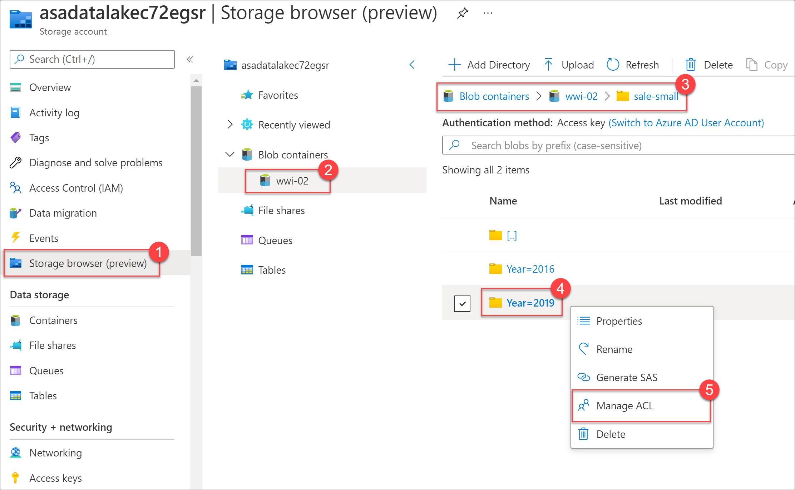

---
lab:
    title: 'Run interactive queries using serverless SQL pools'
    module: 'Module 2'
---

# Lab 2 - Run interactive queries using serverless SQL pools

In this lab, you will learn how to work with files stored in the data lake and external file sources, through T-SQL statements executed by a serverless SQL pool in Azure Synapse Analytics. You will query Parquet files stored in a data lake, as well as CSV files stored in an external data store. Next, you will create Azure Active Directory security groups and enforce access to files in the data lake through Role-Based Access Control (RBAC) and Access Control Lists (ACLs).

After completing this lab, you will be able to:

- Query Parquet data with serverless SQL pools
- Create external tables for Parquet and CSV files
- Create views with serverless SQL pools
- Secure access to data in a data lake when using serverless SQL pools
- Configure data lake security using Role-Based Access Control (RBAC) and Access Control Lists (ACLs)

## Lab setup and pre-requisites

Before starting this lab, ensure you have successfully completed the setup steps to create your lab environment.

## Exercise 1: Querying a Data Lake Store using serverless SQL pools in Azure Synapse Analytics

Understanding data through data exploration is one of the core challenges faced today by data engineers and data scientists as well. Depending on the underlying structure of the data as well as the specific requirements of the exploration process, different data processing engines will offer varying degrees of performance, complexity, and flexibility.

In Azure Synapse Analytics, you can use either SQL, Apache Spark for Synapse, or both. Which service you use mostly depends on your personal preference and expertise. When conducting data engineering tasks, both options can be equally valid in many cases. However, there are certain situations where harnessing the power of Apache Spark can help you overcome problems with the source data. This is because in a Synapse Notebook, you can import from a large number of free libraries that add functionality to your environment when working with data. There are other situations where it is much more convenient and faster using serveless SQL pool to explore the data, or to expose data in the data lake through a SQL view that can be accessed from external tools, like Power BI.

In this exercise, you will explore the data lake using both options.

### Task 1: Query sales Parquet data with serverless SQL pools

When you query Parquet files using serverless SQL pools, you can explore the data with T-SQL syntax.

1. Open Synapse Studio (<https://web.azuresynapse.net/>), and then navigate to the **Data** hub.

    

2. In the pane on the left, on the **Linked** tab, expand **Azure Data Lake Storage Gen2** and the **asaworkspace*xxxxxx***  primary ADLS Gen2 account, and select the **wwi-02** container
3. In the **sale-small/Year=2019/Quarter=Q4/Month=12/Day=20191231** folder, right-click the **sale-small-20191231-snappy.parquet** file, select **New SQL script**, and then select **Select TOP 100 rows**.

    

3. Ensure **Built-in** is selected in the **Connect to** dropdown list above the query window, and then run the query. Data is loaded by the serverless SQL endpoint and processed as if was coming from any regular relational database.

    

    The cell output shows the query results from the Parquet file.

    

4. Modify the SQL query to perform aggregates and grouping operations to better understand the data. Replace the query with the following, replacing *SUFFIX* with the unique suffix for your Azure Data Lake store and making sure that the file path in the OPENROWSET function matches the current file path:

    ```sql
    SELECT
        TransactionDate, ProductId,
            CAST(SUM(ProfitAmount) AS decimal(18,2)) AS [(sum) Profit],
            CAST(AVG(ProfitAmount) AS decimal(18,2)) AS [(avg) Profit],
            SUM(Quantity) AS [(sum) Quantity]
    FROM
        OPENROWSET(
            BULK 'https://asadatalakeSUFFIX.dfs.core.windows.net/wwi-02/sale-small/Year=2019/Quarter=Q4/Month=12/Day=20191231/sale-small-20191231-snappy.parquet',
            FORMAT='PARQUET'
        ) AS [r] GROUP BY r.TransactionDate, r.ProductId;
    ```

    

5. Let's move on from this single file from 2019 and transition to a newer data set. We want to figure out how many records are contained within the Parquet files for all 2019 data. This information is important for planning how we optimize for importing the data into Azure Synapse Analytics. To do this, we'll replace the query with the following (be sure to update the suffix of your data lake in the BULK statement):

    ```sql
    SELECT
        COUNT(*)
    FROM
        OPENROWSET(
            BULK 'https://asadatalakeSUFFIX.dfs.core.windows.net/wwi-02/sale-small/Year=2019/*/*/*/*',
            FORMAT='PARQUET'
        ) AS [r];
    ```

    > Notice how we updated the path to include all Parquet files in all subfolders of *sale-small/Year=2019*.

    The output should be **4124857** records.

### Task 2: Create an external table for 2019 sales data

Rather than creating a script with OPENROWSET and a path to the root 2019 folder every time we want to query the Parquet files, we can create an external table.

1. In Synapse Studio, return to the **wwi-02** tab, which should still be showing the contents of the *sale-small/Year=2019/Quarter=Q4/Month=12/Day=20191231* folder.
2. Right-click the **sale-small-20191231-snappy.parquet** file, select **New SQL script**, and then select **Create external table**. In the New external table dialog box, click **Continue**.
3. Make sure **Built-in** is selected for the **SQL pool**. Then, under **Select a database**, select **+ New** and create a database named `demo`, and click **Create**. For **External table name**, enter `All2019Sales`. Finally, under **Create external table**, ensure **Using SQL script** is selected, and then select **Open Script** to generate the SQL script.

    

    > **Note**: The **Properties** pane for the script open automatically. You can close it by using the **Properties** button above it on the right to make it easier to work with the script.

    The generated script contains the following components:

    - **1)** The script begins with creating the *SynapseParquetFormat* external file format with a *FORMAT_TYPE* of *PARQUET*.
    - **2)** Next, the external data source is created, pointing to the *wwi-02* container of the data lake storage account.
    - **3)** The CREATE EXTERNAL TABLE WITH statement specifies the file location and refers to the new external file format and data source created above.
    - **4)** Finally, we select the top 100 results from the `2019Sales` external table.
    
4. In the CREATE EXTERNAL TABLE statement, in the **[TransactionId] varchar(8000)** line, change 8000 to 4000 and add `COLLATE Latin1_General_100_BIN2_UTF8`; and replace the *LOCATION* value with `sale-small/Year=2019/*/*/*/*.parquet` so that the statement becomes similar to the following (except with your unique resource SUFFIX):

```sql
CREATE EXTERNAL TABLE All2019Sales (
    [TransactionId] varchar(4000) COLLATE Latin1_General_100_BIN2_UTF8,
    [CustomerId] int,
    [ProductId] smallint,
    [Quantity] smallint,
    [Price] numeric(38,18),
    [TotalAmount] numeric(38,18),  
    [TransactionDate] int,
    [ProfitAmount] numeric(38,18),
    [Hour] smallint,
    [Minute] smallint,
    [StoreId] smallint
    )
    WITH (
    LOCATION = 'sale-small/Year=2019/*/*/*/*.parquet',
    DATA_SOURCE = [wwi-02_asadatalakeSUFFIX_dfs_core_windows_net],
    FILE_FORMAT = [SynapseParquetFormat]
    )
GO
```

5. Make sure the script is connected to the serverless SQL pool (**Built-in**) and that the **demo** database is selected in the **Use database** list (use the **...** button to see the list if the pane is too small to display it, and then use the &#8635; button to refresh the list if needed).

    

6. Run the modified script.

    After running the script, we can see the output of the SELECT query against the **All2019Sales** external table. This displays the first 100 records from the Parquet files located in the *YEAR=2019* folder.

    

    > **Tip**: If an error occurs because of a mistake in your code, you should delete any resources that were successfully created before trying again. You can do this by running the appropriate DROP statements, or by switching to the **Workspace** tab, refreshing the list of **Databases**, and deleting the objects in the **demo** database.

### Task 3: Create an external table for CSV files

Tailwind Traders found an open data source for country population data that they want to use. They do not want to merely copy the data since it is regularly updated with projected populations in future years.

You decide to create an external table that connects to the external data source.

1. Replace the SQL script you ran in the previous task with the following code:

    ```sql
    IF NOT EXISTS (SELECT * FROM sys.symmetric_keys) BEGIN
        declare @pasword nvarchar(400) = CAST(newid() as VARCHAR(400));
        EXEC('CREATE MASTER KEY ENCRYPTION BY PASSWORD = ''' + @pasword + '''')
    END

    CREATE DATABASE SCOPED CREDENTIAL [sqlondemand]
    WITH IDENTITY='SHARED ACCESS SIGNATURE',  
    SECRET = 'sv=2018-03-28&ss=bf&srt=sco&sp=rl&st=2019-10-14T12%3A10%3A25Z&se=2061-12-31T12%3A10%3A00Z&sig=KlSU2ullCscyTS0An0nozEpo4tO5JAgGBvw%2FJX2lguw%3D'
    GO

    -- Create external data source secured using credential
    CREATE EXTERNAL DATA SOURCE SqlOnDemandDemo WITH (
        LOCATION = 'https://sqlondemandstorage.blob.core.windows.net',
        CREDENTIAL = sqlondemand
    );
    GO

    CREATE EXTERNAL FILE FORMAT QuotedCsvWithHeader
    WITH (  
        FORMAT_TYPE = DELIMITEDTEXT,
        FORMAT_OPTIONS (
            FIELD_TERMINATOR = ',',
            STRING_DELIMITER = '"',
            FIRST_ROW = 2
        )
    );
    GO

    CREATE EXTERNAL TABLE [population]
    (
        [country_code] VARCHAR (5) COLLATE Latin1_General_BIN2,
        [country_name] VARCHAR (100) COLLATE Latin1_General_BIN2,
        [year] smallint,
        [population] bigint
    )
    WITH (
        LOCATION = 'csv/population/population.csv',
        DATA_SOURCE = SqlOnDemandDemo,
        FILE_FORMAT = QuotedCsvWithHeader
    );
    GO
    ```

    At the top of the script, we create a MASTER KEY with a random password. Next, we create a database-scoped credential for the containers in the external storage account using a shared access signature (SAS) for delegated access. This credential is used when we create the **SqlOnDemandDemo** external data source that points to the location of the external storage account that contains the population data:

    

    > Database-scoped credentials are used when any principal calls the OPENROWSET function with a DATA_SOURCE or selects data from an external table that doesn't access public files. The database scoped credential doesn't need to match the name of storage account because it will be explicitly used in the DATA SOURCE that defines the storage location.

    In the next part of the script, we create an external file format called **QuotedCsvWithHeader**. Creating an external file format is a prerequisite for creating an External Table. By creating an External File Format, you specify the actual layout of the data referenced by an external table. Here we specify the CSV field terminator, string delimiter, and set the FIRST_ROW value to 2 since the file contains a header row:

    

    Finally, at the bottom of the script, we create an external table named **population**. The WITH clause specifies the relative location of the CSV file, points to the data source created above, as well as the *QuotedCsvWithHeader* file format:

    

2. Run the script.

    Note that there are no data results for this query.

3. Replace the SQL script with the following to select from the population external table, filtered by 2019 data where the population is greater than 100 million:

    ```sql
    SELECT [country_code]
        ,[country_name]
        ,[year]
        ,[population]
    FROM [dbo].[population]
    WHERE [year] = 2019 and population > 100000000
    ```

4. Run the script.
5. In the query results, select the **Chart** view, then configure it as follows:

    - **Chart type**: Bar
    - **Category column**: country_name`
    - **Legend (series) columns**: population
    - **Legend position**: bottom - center

    

### Task 4: Create a view with a serverless SQL pool

Let's create a view to wrap a SQL query. Views allow you to reuse queries and are needed if you want to use tools, such as Power BI, in conjunction with serverless SQL pools.

1. In the **Data** hub, on the **Linked** tab, in the **Azure Data Lake Storage Gen2/asaworkspace*xxxxxx*/ wwi-02** container, navigate to the **customer-info** folder. Then right-click the **customerinfo.csv** file, select **New SQL script**, and then **Select TOP 100 rows**.

    

3. Select **Run** to execute the script, and notice that the first row of the CSV file is the column header row. The columns in the resultset are named **C1**, **C2**, and so on.

    

4. Update the script with the following code and **make sure you replace SUFFIX** in the OPENROWSET BULK path with your unique resource suffix.

    ```sql
    CREATE VIEW CustomerInfo AS
        SELECT * 
    FROM OPENROWSET(
            BULK 'https://asadatalakeSUFFIX.dfs.core.windows.net/wwi-02/customer-info/customerinfo.csv',
            FORMAT = 'CSV',
            PARSER_VERSION='2.0',
            FIRSTROW=2
        )
        WITH (
        [UserName] NVARCHAR (50),
        [Gender] NVARCHAR (10),
        [Phone] NVARCHAR (50),
        [Email] NVARCHAR (100),
        [CreditCard] NVARCHAR (50)
        ) AS [r];
        GO

    SELECT * FROM CustomerInfo;
    GO
    ```

    

5. In the **Use database** list, ensure **demo** is still selected, and then run the script.

    We just created the view to wrap the SQL query that selects data from the CSV file, then selected rows from the view:

    

    Notice that the first row no longer contains the column headers. This is because we used the FIRSTROW=2 setting in the OPENROWSET statement when we created the view.

6. In the **Data** hub, select the **Workspace** tab. Then select the actions ellipses **(...)** to the right of the Databases group and select **&#8635; Refresh**. If the workspace is blank, then refresh the browser page.

    

7. Expand the **demo** SQL database.

    

    The database contains the following objects that we created in our earlier steps:

    - **1) External tables**: *All2019Sales* and *population*.
    - **2) External data sources**: *SqlOnDemandDemo* and *wwi-02_asadatalakeinadayXXX_dfs_core_windows_net*.
    - **3) External file formats**: *QuotedCsvWithHeader* and *SynapseParquetFormat*.
    - **4) Views**: *CustomerInfo*

## Exercise 2 - Securing access to data using a serverless SQL pool in Azure Synapse Analytics

Tailwind Traders wants to enforce that any kind of modifications to sales data can happen in the current year only, while allowing all authorized users to query the entirety of data. They have a small group of admins who can modify historic data if needed.

- Tailwind Traders should create a security group in AAD, for example called **tailwind-history-owners**, with the intent that all users who belong to this group will have permissions to modify data from previous years.
- The **tailwind-history-owners** security group needs to be assigned to the Azure Storage built-in RBAC role **Storage Blob Data Owner** for the Azure Storage account containing the data lake. This allows AAD user and service principals that are added to this role to have the ability to modify all data from previous years.
- They need to add the user security principals who will have have permissions to modify all historical data to the **tailwind-history-owners** security group.
- Tailwind Traders should create another security group in AAD, for example called **tailwind-readers**, with the intent that all users who belong to this group will have permissions to read all contents of the file system (**prod** in this case), including all historical data.
- The **tailwind-readers** security group needs to be assigned to the Azure Storage built-in RBAC role **Storage Blob Data Reader** for the Azure Storage account containing the data lake. This allows AAD user and service principals that are added to this security group to have the ability to read all data in the file system, but not to modify it.
- Tailwind Traders should create another security group in AAD, for example called **tailwind-2020-writers**, with the intent that all users who belong to this group will have permissions to modify data only from the year 2020.
- They would create a another security group, for example called **tailwind-current-writers**, with the intent that only security groups would be added to this group. This group will have permissions to modify data only from the current year, set using ACLs.
- They need to add the **tailwind-readers** security group to the **tailwind-current-writers** security group.
- At the start of the year 2020, Tailwind Traders would add **tailwind-current-writers** to the **tailwind-2020-writers** security group.
- At the start of the year 2020, on the **2020** folder, Tailwind Traders would set the read, write and execute ACL permissions for the **tailwind-2020-writers** security group.
- At the start of the year 2021, to revoke write access to the 2020 data they would remove the **tailwind-current-writers** security group from the **tailwind-2020-writers** group. Members of **tailwind-readers** would continue to be able to read the contents of the file system because they have been granted read and execute (list) permissions not by the ACLs but by the RBAC built in role at the level of the file system.
- This approach takes into account that current changes to ACLs do not inherit permissions, so removing the write permission would require writing code that traverses all of its content removing the permission at each folder and file object.
- This approach is relatively fast. RBAC role assignments may take up to five minutes to propagate, regardless of the volume of data being secured.

### Task 1: Create Azure Active Directory security groups

In this segment, we will create security groups as described above. However, our data set ends in 2019, so we will create a **tailwind-2019-writers** group instead of 2021.

1. Switch back to the Azure portal (<https://portal.azure.com>) in a different browser tab, leaving Synapse Studio open.

2. On the **Home** page, expand the portal menu if it is not already expanded, then select **Azure Active Directory**.

    

3. Select **Groups** in the left-hand menu.

    

4. Select **+ New group**.

5. Ensure that the **Security** group type is selected, and enter `tailwind-history-owners-SUFFIX` (where *suffix* is your unique resource suffix) for the **Group name**, and then select **Create**.

    

6. Add a second new security group named `tailwind-readers-SUFFIX` (where *SUFFIX* is your unique resource suffix).
7. Add a third security group named `tailwind-current-writers-SUFFIX` (where *SUFFIX* is your unique resource suffix).
8. Add a fourth security group named `tailwind-2019-writers-SUFFIX` (where *SUFFIX* is your unique resource suffix).

> **Note**: In the remaining instructions in this exercise, we'll omit the *-SUFFIX* part of the role names for clarity. You should work with your uniquely identified role names based on your specific resource suffix.

### Task 2: Add group members

To test out the permissions, we will add your own account to the groups.

1. Open your newly created **tailwind-readers** group.

2. Select **Members** on the left, then select **+ Add members**.

    

3. Search for your user account that you are signed into for the lab, then select **Select**.

4. Open your **tailwind-2019-writers** group.

5. Select **Members** on the left, then select **+ Add members**.

6. Search for `tailwind`, select your **tailwind-current-writers** group, then select **Select**.

    

7. Select **Overview** in the left-hand menu, then **copy** the **Object Id**.

    

    > **Note**: Save the **Object Id** value to Notepad or similar text editor. This will be used in a later step when you assign access control in the storage account.

### Task 3: Configure data lake security - Role-Based Access Control (RBAC)

1. In the Azure portal, open the **data-engineering-synapse-*xxxxxxx*** resource group.

2. Open the **asadatalake*xxxxxxx*** storage account.

    

3. Select **Access Control (IAM)** in the left-hand menu.

    

4. Select the **Role assignments** tab.

    

5. Select **+ Add**, then **Add role assignment**.

    

6. In the **Role** screen, search and select **Storage Blob Data Reader** and then click on **Next**. In the **Members** screen, click on **+ Select members** then search for `tailwind-readers` and select your **tailwind-readers** group in the results. Then click **Select**. Then click on **Review + assign**, and click on **Review + assign** a second time.

    Because your user account is added to this group, you will have read access to all files in the blob containers of this account. Tailwind Traders would need to add all users to the **tailwind-readers** security group.

7. Select **+ Add**, then **Add role assignment**.

    

8. For **Role**, search **Storage Blob Data Owner**, then select **Next**.

9. In the **Members** screen, click on **+ Select Members** and search for `tailwind` and select your **tailwind-history-owners** group in the results. Then click on **Review + Assign**, and click on **Review + Assign** again.

    The **tailwind-history-owners** security group is now assigned to the Azure Storage built-in RBAC role **Storage Blob Data Owner** for the Azure Storage account containing the data lake. This allows Azure AD user and service principals that are added to this role to have the ability to modify all data.

    Tailwind Traders needs to add the user security principals who will have have permissions to modify all historical data to the **tailwind-history-owners** security group.

10. In the **Access Control (IAM)** list for the storage account, select your Azure user account under the **Storage Blob Data Owner** role, then select **Remove**.

    Notice that the **tailwind-history-owners** group is assigned to the **Storage Blob Data Owner** group, and **tailwind-readers** is assigned to the **Storage Blob Data Reader** group.

    > **Note**: You may need to navigate back to the resource group, then come back to this screen to see all of the new role assignments.

### Task 4: Configure data lake security - Access Control Lists (ACLs)

1. Select **Storage browser (preview)** on the left-hand menu. Expand **Blob containers** and select the **wwi-02** container. Open the **sale-small** folder, right-click the **Year=2019** folder, then select **Manage ACL**.

    

2. In the Manage ACL screen, in the **Access permissions** screen, click on **+ Add principal**, paste the **object Id** value you copied from the **tailwind-2019-writers** security group into the **Add  principal** search box, click on **tailwind-2019-writers-suffix**, then select **Select**.

3. Now you should see that the **tailwind-2019-writers** group is selected in the Manage ACL dialog. Check **Read**, **Write**, and **Execute** checkboxes, then select **Save**.

4. In the Manage ACL screen, select the **Default permissions** tab. Enable the checkbox for **Configure default permissions**, then click on **+ Add principal**, paste the **object Id** value you copied from the **tailwind-2019-writers** security group into the **Add  principal** search box, click on **tailwind-2019-writers-suffix**, then select **Select**. Check **Read**, **Write**, and **Execute** checkboxes for the new object, then select **Save**

    Now the security ACLs have been set to allow any users added to the **tailwind-current** security group to write to the **Year=2019** folder, by way of the **tailwind-2019-writers** group. These users can only manage current (2019 in this case) sales files.  

    At the start of the following year, to revoke write access to the 2019 data they would remove the **tailwind-current-writers** security group from the **tailwind-2019-writers** group. Members of **tailwind-readers** would continue to be able to read the contents of the file system because they have been granted read and execute (list) permissions not by the ACLs but by the RBAC built in role at the level of the file system.

    Notice that we configured both the _access_ ACLs and _default_ ACLs in this configuration.

    *Access* ACLs control access to an object. Files and directories both have access ACLs.

    *Default* ACLs are templates of ACLs associated with a directory that determine the access ACLs for any child items that are created under that directory. Files do not have default ACLs.

    Both access ACLs and default ACLs have the same structure.
    
    **Note** be sure to save after configuring permissions.

### Task 5: Test permissions

1. In Synapse Studio, in the **Data** hub, on the **Linked** tab select the **Azure Data Lake Storage Gen2/asaworkspace*xxxxxxx*/wwi02** container; and in the *sale-small/Year=2019/Quarter=Q4/Month=12/Day=20191231* folder, right-click the **sale-small-20191231-snappy.parquet file**, select **New SQL script**, and select **Select TOP 100 rows**.

    

2. Ensure **Built-in** is selected in the **Connect to** dropdown list above the query window, then run the query. Data is loaded by the serverless SQL pool endpoint and processed as if was coming from any regular relational database.

    

    The cell output shows the query results from the Parquet file.

    

    The read permissions to the Parquet file assigned to us through the **tailwind-readers** security group, which then is granted RBAC permissions on the storage account through the **Storage Blob Data Reader** role assignment, is what enabled us to view the file contents.

    However, since we removed our account from the **Storage Blob Data Owner** role, and we did not add our account to the **tailwind-history-owners** security group, what if we try to write to this directory?

    Let's give it a try.

3. In the **wwi-02** pane, right-click the **sale-small-20191231-snappy.parquet** file, select **New Notebook**, then select **Load to DataFrame**.

    

4. Attach your **SparkPool01** Spark pool to the notebook.

    

5. Run the cell in the notebook to load the data into a datafame. This may take a while as the spark pool is started, but eventually it should display the first ten rows of the data - confirming once again that you have permission to read data in this location.

6. Under the results, select **+ Code** to add a code cell beneath the existing cell.

7. Enter the following code, replacing *SUFFIX* with the unique suffix for your data lake resource (you can copy this from cell 1 above):

    ```python
    df.write.parquet('abfss://wwi-02@asadatalakeSUFFIX.dfs.core.windows.net/sale-small/Year=2019/Quarter=Q4/Month=12/Day=20191231/sale-small-20191231-snappy-test.parquet')
    ```

8. Run the new cell you just added. You should see a **403 error** in the output.

    

    As expected, you do not have write permissions. The error returned by cell 2 is, *This request is not authorized to perform this operation using this permission.*, with a status code of 403.

9. Publish the notebook and end the session. Then sign out of Azure Synapse Studio and close the browser tab, returning to the Azure portal tab (<https://portal.azure.com>).

10. On the **Home** page, in the portal menu, select **Azure Active Directory**.

11. Select **Groups** in the left-hand menu.

12. Type `tailwind` in the search box, then select your **tailwind-history-owners** group in the results.

13. Select **Members** on the left, then select **+ Add members**.

14. Add your user account that you are signed into for the lab, then select **Select**.

15. In a new tab, browse to Azure Synapse Studio (<https://web.azuresynapse.net/>). Then  on the **Develop** tab, expand **Notebooks** and re-open the notebook you published previously.

16. Click **Run All** to re-run all of the cells in the notebook. After a while, the Spark session will start and the code will run. Cell 2 should return a status of **Succeeded**, indicating that a new file was written to the data lake store.

    

    The cell succeeded this time because we added our account to the **tailwind-history-owners** group, which is assigned the **Storage Blob Data Owner** role.

    > **Note**: If you encounter the same error this time, **stop the Spark session** on the notebook, then select **Publish all**, then Publish. After publishing your changes, select your user profile on the top-right corner of the page and **log out**. **Close the browser tab** after logout is successful, then re-launch Synapse Studio (<https://web.azuresynapse.net/>), re-open the notebook, then re-run the cell. This may be needed because you must refresh the security token for the auth changes to take place.

17. At the top right of the notebook, use the **Stop Session** button to stop the notebook session.

18. Publish the notebook if you want to save the changes. Then close it.

    Now let's verify that the file was written to the data lake.

19. In Synapse Studio, in the **Data** hub, on the **Linked** tab select the **Azure Data Lake Storage Gen2/asaworkspace*xxxxxxx*/wwi02** container; and browse to the *sale-small/Year=2019/Quarter=Q4/Month=12/Day=20191231* folder to verify that a new file has been added to this folder.

    
