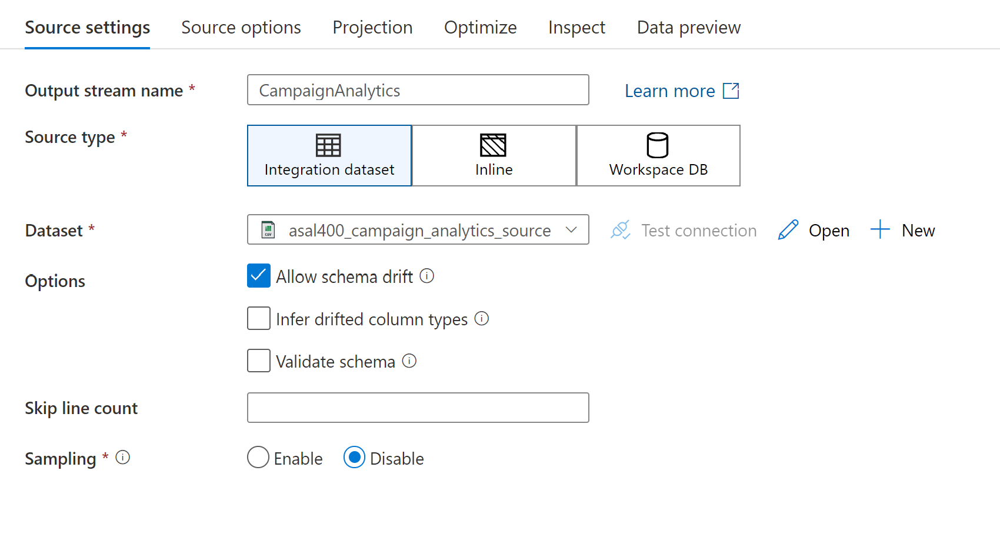
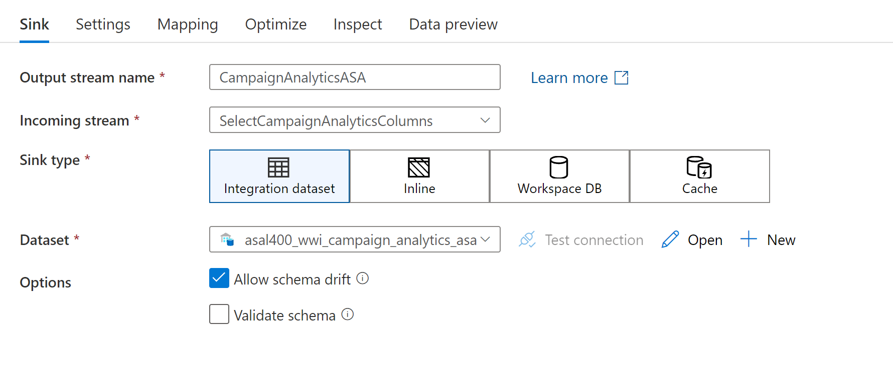
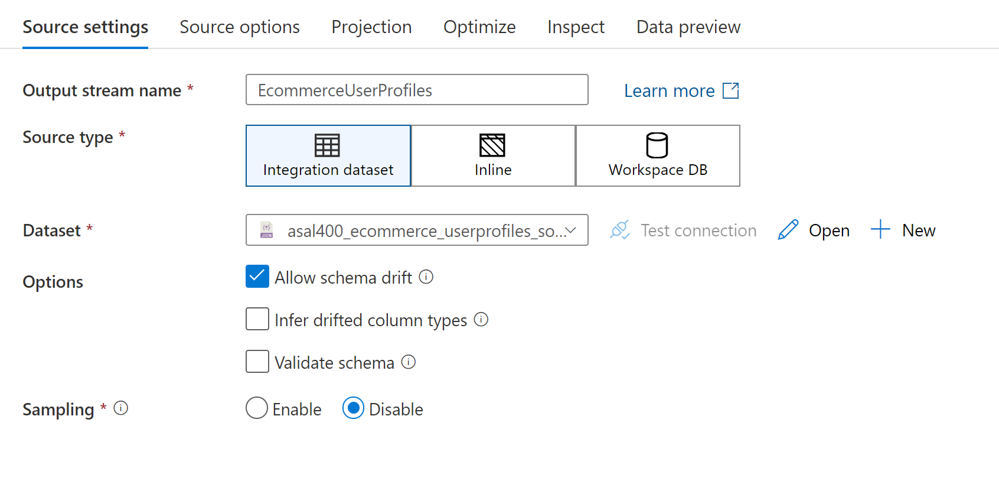
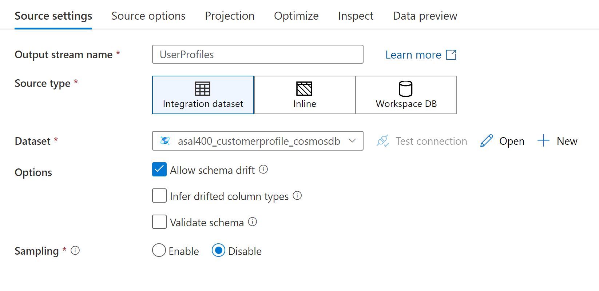
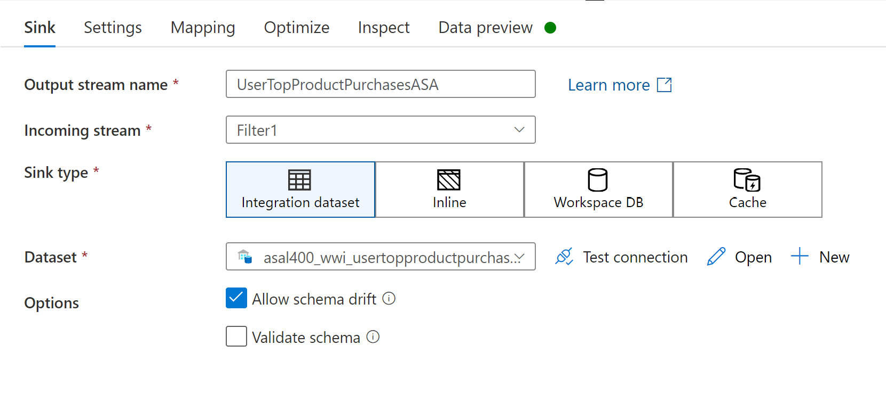
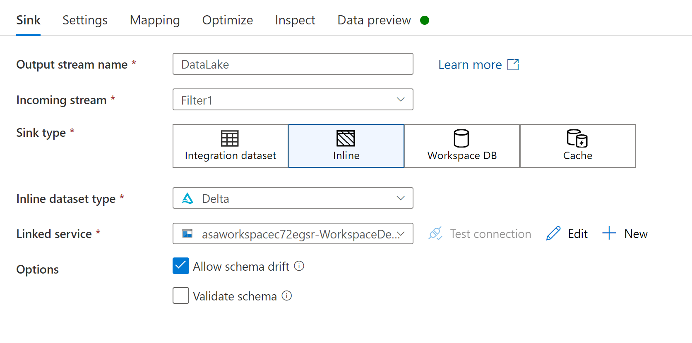
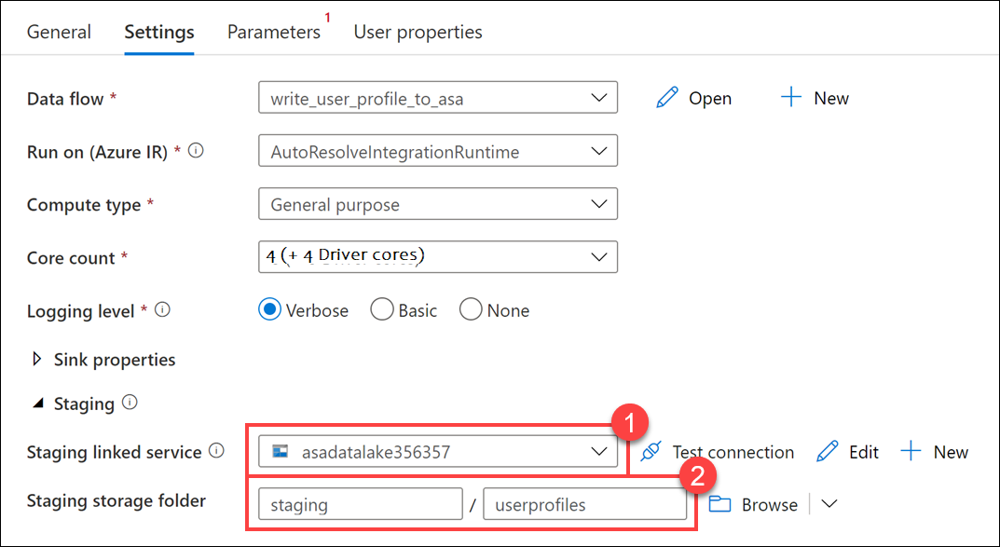

---
lab:
    title: 'Transform data with Azure Data Factory or Azure Synapse Pipelines'
    module: 'Module 6'
---

# Lab 6 - Transform data with Azure Data Factory or Azure Synapse Pipelines

This lab teaches you how to build data integration pipelines to ingest from multiple data sources, transform data using mapping data flows and notebooks, and perform data movement into one or more data sinks.

After completing this lab, you will be able to:

- Execute code-free transformations at scale with Azure Synapse Pipelines
- Create data pipeline to import poorly formatted CSV files
- Create Mapping Data Flows

## Lab setup and pre-requisites

Before starting this lab, you must complete **Lab 5: *Ingest and load data into the Data Warehouse***.

This lab uses the dedicated SQL pool you created in the previous lab. You should have paused the SQL pool at the end of the previous lab, so resume it by following these instructions:

1. Open Synapse Studio (<https://web.azuresynapse.net/>).
2. Select the **Manage** hub.
3. Select **SQL pools** in the left-hand menu. If the **SQLPool01** dedicated SQL pool is paused, hover over its name and select **&#9655;**.

    

4. When prompted, select **Resume**. It will take a minute or two to resume the pool.
5. Continue to the next exercise while the dedicated SQL pool resumes.

> **Important:** Once started, a dedicated SQL pool consumes credits in your Azure subscription until it is paused. If you take a break from this lab, or decide not to complete it; follow the instructions at the end of the lab to pause your SQL pool!

## Exercise 1 - Code-free transformation at scale with Azure Synapse Pipelines

Tailwind Traders would like code-free options for data engineering tasks. Their motivation is driven by the desire to allow junior-level data engineers who understand the data but do not have a lot of development experience build and maintain data transformation operations. The other driver for this requirement is to reduce fragility caused by complex code with reliance on libraries pinned to specific versions, remove code testing requirements, and improve ease of long-term maintenance.

Their other requirement is to maintain transformed data in a data lake in addition to the dedicated SQL pool. This gives them the flexibility to retain more fields in their data sets than they otherwise store in fact and dimension tables, and doing this allows them to access the data when they have paused the dedicated SQL pool, as a cost optimization.

Given these requirements, you recommend building Mapping Data Flows.

Mapping Data flows are pipeline activities that provide a visual way of specifying how to transform data, through a code-free experience. This feature offers data cleansing, transformation, aggregation, conversion, joins, data copy operations, etc.

Additional benefits

- Cloud scale via Spark execution
- Guided experience to easily build resilient data flows
- Flexibility to transform data per user’s comfort
- Monitor and manage data flows from a single pane of glass

### Task 1: Create SQL table

The Mapping Data Flow we will build will write user purchase data to a dedicated SQL pool. Tailwind Traders does not yet have a table to store this data. We will execute a SQL script to create this table as a pre-requisite.

1. In Synapse Analytics Studio, navigate to the **Develop** hub.

    

2. In the **+** menu, select **SQL script**.

    

3. In the toolbar menu, connect to the **SQLPool01** database.

    

4. In the query window, replace the script with the following code to create a new table that joins users' preferred products stored in Azure Cosmos DB with top product purchases per user from the e-commerce site, stored in JSON files within the data lake:

    ```sql
    CREATE TABLE [wwi].[UserTopProductPurchases]
    (
        [UserId] [int]  NOT NULL,
        [ProductId] [int]  NOT NULL,
        [ItemsPurchasedLast12Months] [int]  NULL,
        [IsTopProduct] [bit]  NOT NULL,
        [IsPreferredProduct] [bit]  NOT NULL
    )
    WITH
    (
        DISTRIBUTION = HASH ( [UserId] ),
        CLUSTERED COLUMNSTORE INDEX
    )
    ```

5. Select **Run** on the toolbar menu to run the script (you may need to wait for the SQL pool to resume).

    

6. In the query window, replace the script with the following to create a new table for the Campaign Analytics CSV file:

    ```sql
    CREATE TABLE [wwi].[CampaignAnalytics]
    (
        [Region] [nvarchar](50)  NOT NULL,
        [Country] [nvarchar](30)  NOT NULL,
        [ProductCategory] [nvarchar](50)  NOT NULL,
        [CampaignName] [nvarchar](500)  NOT NULL,
        [Revenue] [decimal](10,2)  NULL,
        [RevenueTarget] [decimal](10,2)  NULL,
        [City] [nvarchar](50)  NULL,
        [State] [nvarchar](25)  NULL
    )
    WITH
    (
        DISTRIBUTION = HASH ( [Region] ),
        CLUSTERED COLUMNSTORE INDEX
    )
    ```

7. Run the script to create the table.

### Task 2: Create linked service

Azure Cosmos DB is one of the data sources that will be used in the Mapping Data Flow. Tailwind Traders has not yet created the linked service. Follow the steps in this section to create one.

> **Note**: Skip this section if you have already created a Cosmos DB linked service.

1. Navigate to the **Manage** hub.

    

2. Open **Linked services** and select **+ New** to create a new linked service. Select **Azure Cosmos DB (SQL API)** in the list of options, then select **Continue**.

    

3. Name the linked service `asacosmosdb01`, and then select the **asacosmosdb*xxxxxxx*** Cosmos DB account name and the **CustomerProfile** database. Then select **Test connection** to ensure success, before clicking **Create**.

    

### Task 3: Create data sets

User profile data comes from two different data sources, which we will create now. The customer profile data from an e-commerce system that provides top product purchases for each visitor of the site (customer) over the past 12 months is stored within JSON files in the data lake. User profile data containing, among other things, product preferences and product reviews is stored as JSON documents in Cosmos DB.

In this section, you'll create datasets for the SQL tables that will serve as data sinks for data pipelines you'll create later in this lab.

1. Navigate to the **Data** hub.

    

2. In the **+** menu, select **Integration dataset** to create a new dataset.

    

3. Select **Azure Cosmos DB (SQL API)**, then click **Continue**.

    

4. Configure the dataset as follows, then select **OK**:

    - **Name**: Enter `asal400_customerprofile_cosmosdb`.
    - **Linked service**: Select **asacosmosdb01**.
    - **Collection**: Select **OnlineUserProfile01**.

        

5. After creating the dataset, select **Preview data** under its **Connection** tab.

    

6. Preview data queries the selected Azure Cosmos DB collection and returns a sample of the documents within. The documents are stored in JSON format and include fields for **userId**, **cartId**, **preferredProducts** (an array of product IDs that may be empty), and **productReviews** (an array of written product reviews that may be empty).

    

7. Close the preview. Then on the **Data** hub, in the **+** menu, select **Integration dataset** to create the second source data dataset we need.

    

8. Select **Azure Data Lake Storage Gen2**, then click **Continue**.

    

9. Select the **JSON** format, then select **Continue**.

    

10. Configure the dataset as follows, then select **OK**:

    - **Name**: Enter `asal400_ecommerce_userprofiles_source`.
    - **Linked service**: Select the **asadatalake*xxxxxxx*** linked service.
    - **File path**: Browse to the **wwi-02/online-user-profiles-02** path.
    - **Import schema**: Select **From connection/store**.

    

11. On the **Data** hub, in the **+** menu, select **Integration dataset** to create a third dataset that references the destination table for campaign analytics.

    

12. Select **Azure Synapse Analytics**, then select **Continue**.

    

13. Configure the dataset as follows, then select **OK**:

    - **Name**: Enter `asal400_wwi_campaign_analytics_asa`.
    - **Linked service**: Select the **SqlPool01** .
    - **Table name**: Select **wwi.CampaignAnalytics**.
    - **Import schema**: Select **From connection/store**.

    

14. On the **Data** hub, in the **+** menu, select **Integration dataset** to create a fourth dataset that references the destination table for top product purchases.

    

15. Select **Azure Synapse Analytics**, then select **Continue**.

    

16. Configure the dataset as follows, then select **OK**:

    - **Name**: Enter `asal400_wwi_usertopproductpurchases_asa`.
    - **Linked service**: Select the **SqlPool01**.
    - **Table name**: Select **wwi.UserTopProductPurchases**.
    - **Import schema**: Select **From connection/store**.

    

### Task 4: Create campaign analytics dataset

Your organization was provided a poorly formatted CSV file containing marketing campaign data. The file was uploaded to the data lake and now it must be imported into the data warehouse.


Issues include invalid characters in the revenue currency data, and misaligned columns.

1. On the **Data** hub, in the **+** menu, select **Integration dataset** to create a new dataset.

    

2. Select **Azure Data Lake Storage Gen2**, then select **Continue**.

    

3. Select the **DelimitedText** format, then select **Continue**.

    

4. Configure the dataset as follows, then select **OK**:

    - **Name**: Enter `asal400_campaign_analytics_source`.
    - **Linked service**: Select the **asadatalake*xxxxxxx*** linked service.
    - **File path**: Browse to **wwi-02/campaign-analytics/campaignanalytics.csv**.
    - **First row as header**: Leave unchecked (we are skipping the header because there is a mismatch between the number of columns in the header and the number of columns in the data rows).
    - **Import schema**: Select **From connection/store**.

    

5. After creating the dataset, on its **Connection** tab, review the default settings. They should match the following configuration:

    - **Compression type**: None.
    - **Column delimiter**: Comma (,)
    - **Row delimiter**: Default (\r,\n, or \r\n)
    - **Encoding**: Default(UTF-8)
    - **Escape character**: Backslash (\\)
    - **Quote character**: Double quote (")
    - **First row as header**: *Unchecked*
    - **Null value**: *Empty*

    

6. Select **Preview data** (close the **Properties** pane if it is in the way).

    The preview displays a sample of the CSV file. You can see some of the issues shown at the beginning of this task. Notice that since we are not setting the first row as the header, the header columns appear as the first row. Also, notice that the city and state values do not appear. This is because of the mismatch in the number of columns in the header row compared to the rest of the file. We will exclude the first row when we create the data flow in the next exercise.

    

7. Close the preview, and then select **Publish all** and click **Publish** to save your new resources.

    

### Task 5: Create campaign analytics data flow

1. Navigate to the **Develop** hub.

    

2. In the **+** menu, select **Data flow** to create a new data flow (if a tip is displayed, close it.)

    

3. In the **General** settings of the **Properties** blade of the new data flow, change the **Name** to `asal400_lab2_writecampaignanalyticstoasa`.

    

4. Select **Add Source** on the data flow canvas (again, if a tip is displayed, close it.)

    

5. Under **Source settings**, configure the following:

    - **Output stream name**: Enter `CampaignAnalytics`.
    - **Source type**: Select **Integration dataset**.
    - **Dataset**: Select **asal400_campaign_analytics_source**.
    - **Options**: Select **Allow schema drift** and leave the other options unchecked.
    - **Skip line count**: Enter `1`. This allows us to skip the header row which has two fewer columns than the rest of the rows in the CSV file, truncating the last two data columns.
    - **Sampling**: Select **Disable**.

    

    When you create data flows, certain features are enabled by turning on debug, such as previewing data and importing a schema (projection). Due to the amount of time it takes to enable this option, and to minimize resource consumption in the lab environment, we will bypass these features.
    
6. The data source has a schema we need to set. To do this, select **Script** above the design canvas.

    

7. Replace the script with the following to provide the column mappings, then select **OK**:

    ```json
    source(output(
            {_col0_} as string,
            {_col1_} as string,
            {_col2_} as string,
            {_col3_} as string,
            {_col4_} as string,
            {_col5_} as double,
            {_col6_} as string,
            {_col7_} as double,
            {_col8_} as string,
            {_col9_} as string
        ),
        allowSchemaDrift: true,
        validateSchema: false,
        ignoreNoFilesFound: false,
        skipLines: 1) ~> CampaignAnalytics
    ```

8. Select the **CampaignAnalytics** data source, then select **Projection**. The projection should display the following schema:

    

9. Select the **+** to the right of the **CampaignAnalytics** step, then select the **Select** schema modifier.

    

10. Under **Select settings**, configure the following:

    - **Output stream name**: Enter `MapCampaignAnalytics`.
    - **Incoming stream**: Select **CampaignAnalytics**.
    - **Options**: Check both options.
    - **Input columns**: make sure **Auto mapping** is unselected, then provide the following values in the **Name as** fields:
      - `Region`
      - `Country`
      - `ProductCategory`
      - `CampaignName`
      - `RevenuePart1`
      - `Revenue`
      - `RevenueTargetPart1`
      - `RevenueTarget`
      - `City`
      - `State`

    

11. Select the **+** to the right of the **MapCampaignAnalytics** step, then select the **Derived Column** schema modifier.

    

12. Under **Derived column's settings**, configure the following:

    - **Output stream name**: Enter `ConvertColumnTypesAndValues`.
    - **Incoming stream**: Select **MapCampaignAnalytics**.
    - **Columns**: Provide the following information:

        | Column | Expression |
        | --- | --- |
        | Revenue | `toDecimal(replace(concat(toString(RevenuePart1), toString(Revenue)), '\\', ''), 10, 2, '$###,###.##')` |
        | RevenueTarget | `toDecimal(replace(concat(toString(RevenueTargetPart1), toString(RevenueTarget)), '\\', ''), 10, 2, '$###,###.##')` |

    > **Note**: To insert the second column, select **+ Add** above the Columns list, then select **Add column**.

    

    The expressions you defined will concatenate and clean-up the **RevenuePart1** and **Revenue** values and the **RevenueTargetPart1** and **RevenueTarget** values.

13. Select the **+** to the right of the **ConvertColumnTypesAndValues** step, then select the **Select** schema modifier from the context menu.

    

14. Under **Select settings**, configure the following:

    - **Output stream name**: Enter `SelectCampaignAnalyticsColumns`.
    - **Incoming stream**: Select **ConvertColumnTypesAndValues**.
    - **Options**: Check both options.
    - **Input columns**: make sure **Auto mapping** is unchecked, then **Delete** **RevenuePart1** and **RevenueTargetPart1**. We no longer need these fields.

    

15. Select the **+** to the right of the **SelectCampaignAnalyticsColumns** step, then select the **Sink** destination.

    

16. Under **Sink**, configure the following:

    - **Output stream name**: Enter `CampaignAnalyticsASA`.
    - **Incoming stream**: Select **SelectCampaignAnalyticsColumns**.
    - **Sink type**: Select **Integration dataset**.
    - **Dataset**: Select **asal400_wwi_campaign_analytics_asa**.
    - **Options**: Check **Allow schema drift** and uncheck **Validate schema**.

    

17. On the **Settings** tab, configure the following options:

    - **Update method**: Check **Allow insert** and leave the rest unchecked.
    - **Table action**: Select **Truncate table**.
    - **Enable staging**: Uncheck this option. The sample CSV file is small, making the staging option unnecessary.

    

18. Your completed data flow should look similar to the following:

    

19. Select **Publish all** then **Publish** to save your new data flow.

    

### Task 6: Create campaign analytics data pipeline

In order to run the new data flow, you need to create a new pipeline and add a data flow activity to it.

1. Navigate to the **Integrate** hub.

    

2. In the **+** menu, select **Pipeline** to create a new pipeline.

    

3. In the **General** section of the **Properties** blade for the new pipeline, enter the following **Name**: `Write Campaign Analytics to ASA`.

4. Expand **Move & transform** within the Activities list, then drag the **Data flow** activity onto the pipeline canvas.

    

5. On the **General** tab for the data flow (beneath the pipeline canvas), set the **Name** to `asal400_lab2_writecampaignanalyticstoasa`.

    

6. Select the **Settings** tab; and then, in the **Data flow** list, select **asal400_lab2_writecampaignanalyticstoasa** .

    

8. Select **Publish all** to save your new pipeline, and then select **Publish**.

    

### Task 7: Run the campaign analytics data pipeline

1. Select **Add trigger**, and then select **Trigger now** in the toolbar at the top of the pipeline canvas.

    

2. In the **Pipeline run** pane, select **OK** to start the pipeline run.

    

3. Navigate to the **Monitor** hub.

    

4. Wait for the pipeline run to successfully complete, which will take some time. You may need to refresh the view.

    

### Task 8: View campaign analytics table contents

Now that the pipeline run is complete, let's take a look at the SQL table to verify the data successfully copied.

1. Navigate to the **Data** hub.

    

2. Expand the **SqlPool01** database underneath the **Workspace** section, then expand **Tables** (you may need to refresh to see the new tables).

3. Right-click the **wwi.CampaignAnalytics** table, then select **New SQL script** and **Select TOP 100 rows**. 

    

4. The properly transformed data should appear in the query results.

    

5. Modify the query as follows and run the script:

    ```sql
    SELECT ProductCategory
    ,SUM(Revenue) AS TotalRevenue
    ,SUM(RevenueTarget) AS TotalRevenueTarget
    ,(SUM(RevenueTarget) - SUM(Revenue)) AS Delta
    FROM [wwi].[CampaignAnalytics]
    GROUP BY ProductCategory
    ```

6. In the query results, select the **Chart** view. Configure the columns as defined:

    - **Chart type**: Column.
    - **Category column**: ProductCategory.
    - **Legend (series) columns**: TotalRevenue, TotalRevenueTarget, and Delta.

    

## Exercise 2 - Create Mapping Data Flow for top product purchases

Tailwind Traders needs to combine top product purchases imported as JSON files from their eCommerce system with user preferred products from profile data stored as JSON documents in Azure Cosmos DB. They want to store the combined data in a dedicated SQL pool as well as their data lake for further analysis and reporting.

To do this, you will build a mapping data flow that performs the following tasks:

- Adds two ADLS Gen2 data sources for the JSON data
- Flattens the hierarchical structure of both sets of files
- Performs data transformations and type conversions
- Joins both data sources
- Creates new fields on the joined data set based on conditional logic
- Filters null records for required fields
- Writes to the dedicated SQL pool
- Simultaneously writes to the data lake

### Task 1: Create Mapping Data Flow

1. In Synapse Analytics Studio, navigate to the **Develop** hub.

    

2. In the **+** menu, select **Data flow** to create a new data flow.

    

3. In the **General** section of the **Properties** pane of the new data flow, update the **Name** to the following: `write_user_profile_to_asa`.

    

4. Select the **Properties** button to hide the pane.

    

5. Select **Add Source** on the data flow canvas.

    

6. Under **Source settings**, configure the following:

    - **Output stream name**: Enter `EcommerceUserProfiles`.
    - **Source type**: Select **Integration dataset**.
    - **Dataset**: Select **asal400_ecommerce_userprofiles_source**.

        

7. Select the **Source options** tab, then configure the following:

    - **Wildcard paths**: Enter `online-user-profiles-02/*.json`

8. Select the **+** to the right of the **EcommerceUserProfiles** source, then select the **Derived Column** schema modifier.

    

9. Under **Derived column's settings**, configure the following:

    - **Output stream name**: Enter `userId`.
    - **Incoming stream**: Select **EcommerceUserProfiles**.
    - **Columns**: Provide the following information:

        | Column | Expression |
        | --- | --- |
        | visitorId | `toInteger(visitorId)` |

        

        This expression converts the **visitorId** column value to an integer data type.

10. Select the **+** to the right of the **userId** step, then select the **Flatten** formatter.

    

11. Under **Flatten settings**, configure the following:

    - **Output stream name**: Enter `UserTopProducts`.
    - **Incoming stream**: Select **userId**.
    - **Unroll by**: Select **[] topProductPurchases**.
    - **Input columns**: Provide the following information:

        | userId's column | Name as |
        | --- | --- |
        | visitorId | `visitorId` |
        | topProductPurchases.productId | `productId` |
        | topProductPurchases.itemsPurchasedLast12Months | `itemsPurchasedLast12Months` |

        > Select **+ Add mapping**, then select **Fixed mapping** to add each new column mapping.

        

    These settings provide a flattened representation of the data.

12. The user interface defines the mappings by generating a script. To view the script, select the **Script** button on the toolbar.

    

    Verify that the script looks like this and then **Cancel** to return the graphical UI (if not, modify the script):

    ```
    source(output(
            visitorId as string,
            topProductPurchases as (productId as string, itemsPurchasedLast12Months as string)[]
        ),
        allowSchemaDrift: true,
        validateSchema: false,
        ignoreNoFilesFound: false,
        documentForm: 'arrayOfDocuments',
        wildcardPaths:['online-user-profiles-02/*.json']) ~> EcommerceUserProfiles
    EcommerceUserProfiles derive(visitorId = toInteger(visitorId)) ~> userId
    userId foldDown(unroll(topProductPurchases),
        mapColumn(
            visitorId,
            productId = topProductPurchases.productId,
            itemsPurchasedLast12Months = topProductPurchases.itemsPurchasedLast12Months
        ),
        skipDuplicateMapInputs: false,
        skipDuplicateMapOutputs: false) ~> UserTopProducts
    ```

13. Select the **+** to the right of the **UserTopProducts** step, then select the **Derived Column** schema modifier from the context menu.

    

14. Under **Derived column's settings**, configure the following:

    - **Output stream name**: Enter `DeriveProductColumns`.
    - **Incoming stream**: Select **UserTopProducts**.
    - **Columns**: Provide the following information:

        | Column | Expression |
        | --- | --- |
        | productId | `toInteger(productId)` |
        | itemsPurchasedLast12Months | `toInteger(itemsPurchasedLast12Months)`|

        

        > **Note**: To add a column to the derived column settings, select **+** to the right of the first column, then select **Add column**.

        

        These expressions convert the **productid** and **itemsPurchasedLast12Months** columns values to integers.

15. Select **Add Source** on the data flow canvas beneath the **EcommerceUserProfiles** source.

    

16. Under **Source settings**, configure the following:

    - **Output stream name**: Enter `UserProfiles`.
    - **Source type**: Select **Integration dataset**.
    - **Dataset**: Select **asal400_customerprofile_cosmosdb**.

        

17. Since we are not using the data flow debugger, we need to enter the data flow's Script view to update the source projection. Select **Script** in the toolbar above the canvas.

    

18. Locate the **UserProfiles** source in the script, which looks like this:

    ```
    source(output(
        userId as string,
        cartId as string,
        preferredProducts as string[],
        productReviews as (productId as string, reviewText as string, reviewDate as string)[]
    ),
    allowSchemaDrift: true,
    validateSchema: false,
    format: 'document') ~> UserProfiles
    ```

19. Modify script block as follows to set **preferredProducts** as an **integer[]** array and ensure the data types within the **productReviews** array are correctly defined. Then select **OK** to apply the script changes.

    ```
    source(output(
            cartId as string,
            preferredProducts as integer[],
            productReviews as (productId as integer, reviewDate as string, reviewText as string)[],
            userId as integer
        ),
        allowSchemaDrift: true,
        validateSchema: false,
        ignoreNoFilesFound: false,
        format: 'document') ~> UserProfiles
    ```

20. Select the **+** to the right of the **UserProfiles** source, then select the **Flatten** formatter.

    

21. Under **Flatten settings**, configure the following:

    - **Output stream name**: Enter `UserPreferredProducts`.
    - **Incoming stream**: Select **UserProfiles**.
    - **Unroll by**: Select **[] preferredProducts**.
    - **Input columns**: Provide the following information. Be sure to **delete** **cartId** and **[] productReviews**:

        | UserProfiles's column | Name as |
        | --- | --- |
        | [] preferredProducts | `preferredProductId` |
        | userId | `userId` |


        

22. Now it is time to join the two data sources. Select the **+** to the right of the **DeriveProductColumns** step, then select the **Join** option.

    

23. Under **Join settings**, configure the following:

    - **Output stream name**: Enter `JoinTopProductsWithPreferredProducts`.
    - **Left stream**: Select **DeriveProductColumns**.
    - **Right stream**: Select **UserPreferredProducts**.
    - **Join type**: Select **Full outer**.
    - **Join conditions**: Provide the following information:

        | Left: DeriveProductColumns's column | Right: UserPreferredProducts's column |
        | --- | --- |
        | visitorId | userId |

        

24. Select **Optimize** and configure the following:

    - **Broadcast**: Select **Fixed**.
    - **Broadcast options**: Check **Left: 'DeriveProductColumns'**.
    - **Partition option**: Select **Set partitioning**.
    - **Partition type**: Select **Hash**.
    - **Number of partitions**: Enter `30`.
    - **Column**: Select **productId**.

        

25. Select the **Inspect** tab to see the join mapping, including the column feed source and whether the column is used in a join.

    

26. Select the **+** to the right of the **JoinTopProductsWithPreferredProducts** step, then select the **Derived Column** schema modifier.

    

27. Under **Derived column's settings**, configure the following:

    - **Output stream name**: Enter `DerivedColumnsForMerge`.
    - **Incoming stream**: Select **JoinTopProductsWithPreferredProducts**.
    - **Columns**: Provide the following information (**_type in_ the _first two_ column names**):

        | Column | Expression |
        | --- | --- |
        | `isTopProduct` | `toBoolean(iif(isNull(productId), 'false', 'true'))` |
        | `isPreferredProduct` | `toBoolean(iif(isNull(preferredProductId), 'false', 'true'))` |
        | productId | `iif(isNull(productId), preferredProductId, productId)` | 
        | userId | `iif(isNull(userId), visitorId, userId)` | 

        

        The derived column settings will provide the following result when the pipeline is run:

        

28. Select the **+** to the right of the **DerivedColumnsForMerge** step, then select the **Filter** row modifier.

    

    We are adding the filter step to remove any records where the **ProductId** is null. The data sets have a small percentage of invalid records, and null **ProductId** values will cause errors when loading into the **UserTopProductPurchases** dedicated SQL pool table.

29. Set the **Filter on** expression to `!isNull(productId)`.

    

30. Select the **+** to the right of the **Filter1** step, then select the **Sink** destination from the context menu.

    

31. Under **Sink**, configure the following:

    - **Output stream name**: Enter `UserTopProductPurchasesASA`.
    - **Incoming stream**: Select **Filter1**.
    - **Sink type**: select **Integration Dataset**.
    - **Dataset**: Select **asal400_wwi_usertopproductpurchases_asa**.
    - **Options**: Check **Allow schema drift** and uncheck **Validate schema**.

    

32. Select **Settings**, then configure the following:

    - **Update method**: Check **Allow insert** and leave the rest unchecked.
    - **Table action**: Select **Truncate table**.
    - **Enable staging**: Check this option. Since we are importing a lot of data, we want to enable staging to improve performance.

        

33. Select **Mapping**, then configure the following:

    - **Auto mapping**: De-select this option.
    - **Columns**: Provide the following information:

        | Input columns | Output columns |
        | --- | --- |
        | userId | UserId |
        | productId | ProductId |
        | itemsPurchasedLast12Months | ItemsPurchasedLast12Months |
        | isTopProduct | IsTopProduct |
        | isPreferredProduct | IsPreferredProduct |

        

34. Select the **+** to the right of the **Filter1** step, then select the **Sink** destination from the context menu to add a second sink.

    

35. Under **Sink**, configure the following:

    - **Output stream name**: Enter `DataLake`.
    - **Incoming stream**: Select **Filter1**.
    - **Sink type**: select **Inline**.
    - **Inline dataset type**: select **Delta**.
    - **Linked service**: Select **asaworkspace*xxxxxxx*-WorkspaceDefaultStorage**.
    - **Options**: Check **Allow schema drift** and uncheck **Validate schema**.

        

36. Select **Settings**, then configure the following:

    - **Folder path**: Enter `wwi-02` / `top-products` (type these two values into the fields since the **top-products** folder does not yet exist).
    - **Compression type**: Select **snappy**.
    - **Compression level**: Select **Fastest**.
    - **Vacuum**: Enter `0`.
    - **Table action**: Select **Truncate**.
    - **Update method**: Check **Allow insert** and leave the rest unchecked.
    - **Merge schema (under Delta options)**: Unchecked.

        

37. Select **Mapping**, then configure the following:

    - **Auto mapping**: Uncheck this option.
    - **Columns**: Define the following column mappings:

        | Input columns | Output columns |
        | --- | --- |
        | visitorId | visitorId |
        | productId | productId |
        | itemsPurchasedLast12Months | itemsPurchasedLast12Months |
        | preferredProductId | preferredProductId |
        | userId | userId |
        | isTopProduct | isTopProduct |
        | isPreferredProduct | isPreferredProduct |

        

        > Notice that we have chosen to keep two additional fields for the data lake sink vs. the SQL pool sink (**visitorId** and **preferredProductId**). This is because we aren't adhering to a fixed destination schema (like a SQL table), and because we want to retain the original data as much as possible in the data lake.

38. Verify that your completed data flow looks similar to the following:

    

39. Select **Publish all**, then **Publish** to save your new data flow.

    

## Exercise 3 - Orchestrate data movement and transformation in Azure Synapse Pipelines

Tailwind Traders is familiar with Azure Data Factory (ADF) pipelines and wants to know if Azure Synapse Analytics can either integrate with ADF or has a similar capability. They want to orchestrate data ingest, transformation, and load activities across their entire data catalog, both internal and external to their data warehouse.

You recommend using Synapse Pipelines, which includes over 90 built-in connectors, can load data by manual execution of the pipeline or by orchestration, supports common loading patterns, enables fully parallel loading into the data lake or SQL tables, and shares a code base with ADF.

By using Synapse Pipelines, Tailwind Traders can experience the same familiar interface as ADF without having to use an orchestration service outside of Azure Synapse Analytics.

### Task 1: Create pipeline

Let's start by executing our new Mapping Data Flow. In order to run the new data flow, we need to create a new pipeline and add a data flow activity to it.

1. Navigate to the **Integrate** hub.

    

2. In the **+** menu, select **Pipeline**.

    

3. In the **General** section of the **Properties** pane of the new data flow, update the **Name** to `Write User Profile Data to ASA`.

    

4. Select the **Properties** button to hide the pane.

    

5. Expand **Move & transform** within the Activities list, then drag the **Data flow** activity onto the pipeline canvas.

    

6. Under the **General** tab beneath the pipeline canvas set the **Name** to `write_user_profile_to_asa`.

    

7. On the **Settings** tab, select the **write_user_profile_to_asa** data flow, ensure **AutoResolveIntegrationRuntime** is selected. Choose the **Basic (General purpose)** compute type and set the core count to **4 (+ 4 Driver cores)**.

8. Expand **Staging** and configure the following:

    - **Staging linked service**: Select the **asadatalake*xxxxxxx*** linked service.
    - **Staging storage folder**: Enter `staging` / `userprofiles` (the **userprofiles** folder will be automatically created for you during the first pipeline run).

        

        The staging options under PolyBase are recommended when you have a large amount of data to move into or out of Azure Synapse Analytics. You will want to experiment with enabling and disabling staging on the data flow in a production environment to evaluate the difference in performance.

9. Select **Publish all** then **Publish** to save your pipeline.

    

### Task 2: Trigger, monitor, and analyze the user profile data pipeline

Tailwind Traders wants to monitor all pipeline runs and view statistics for performance tuning and troubleshooting purposes.

You have decided to show Tailwind Traders how to manually trigger, monitor, then analyze a pipeline run.

1. At the top of the pipeline, select **Add trigger**, then **Trigger now**.

    

2. There are no parameters for this pipeline, so select **OK** to run the trigger.

    

3. Navigate to the **Monitor** hub.

    

4. Select **Pipeline runs** and wait for the pipeline run to successfully complete, which may take some time. You may need to refresh the view.

    

5. Select the name of the pipeline to view the pipeline's activity runs.

    

6. Hover over the data flow activity name in the **Activity runs** list, then select the **Data flow details** icon.

    

7. The data flow details displays the data flow steps and processing details. In the example below (which may be different from your results), processing time took around 44 seconds to process the SQL pool sink, and around 12 seconds to process the Data Lake sink. The **Filter1** output was around 1 million rows for both. You can see which activities took the longest to complete. The cluster startup time contributed over 2.5 minutes to the total pipeline run.

    

8. Select the **UserTopProductPurchasesASA** sink to view its details. In the example below (which may be different from your results), you can see that 1,622,203 rows were calculated with a total of 30 partitions. It took around eight seconds to stage the data in ADLS Gen2 prior to writing the data to the SQL table. The total sink processing time in our case was around 44 seconds (4). It is also apparent that we have a *hot partition* that is significantly larger than the others. If we need to squeeze extra performance out of this pipeline, we can re-evaluate data partitioning to more evenly spread the partitions to better facilitate parallel data loading and filtering. We could also experiment with disabling staging to see if there's a processing time difference. Finally, the size of the dedicated SQL pool plays a factor in how long it takes to ingest data into the sink.

    

## Important: Pause your SQL pool

Complete these steps to free up resources you no longer need.

1. In Synapse Studio, select the **Manage** hub.
2. Select **SQL pools** in the left-hand menu. Hover over the **SQLPool01** dedicated SQL pool and select **||**.

    

3. When prompted, select **Pause**.
